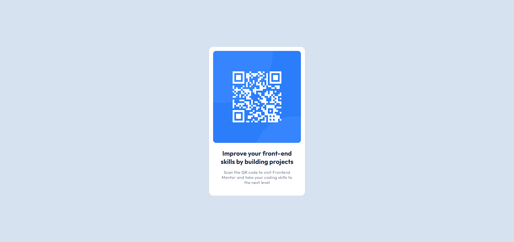

# Frontend Mentor - QR code component solution

This is a solution to the [QR code component challenge on Frontend Mentor](https://www.frontendmentor.io/challenges/qr-code-component-iux_sIO_H). Frontend Mentor challenges help you improve your coding skills by building realistic projects.

## Table of contents

- [Overview](#overview)
  - [Screenshot](#screenshot)
  - [Links](#links)
- [My process](#my-process)
  - [Built with](#built-with)
  - [What I learned](#what-i-learned)
- [Author](#author)
- [Acknowledgments](#acknowledgments)

**Note: Delete this note and update the table of contents based on what sections you keep.**

## Overview

### Screenshot



### Links

- Live Site URL: [GitHub Pages](https://jordanj03.github.io/qr-code)

## My process

### Built with

- HTML5
- CSS3
- Flexbox

### What I learned

how to center a div lol

To see how you can add code snippets, see below:

```html
<main>
  <div class="container"></div>
</main>
```

```css
main {
  height: 100vh;
  display: flex;
  justify-content: center;
  align-items: center;
}

.container {
  height: 250px;
  width: 250px;
  /* SUCCESS!! */
}
```

## Author

- Jordan Johnston

## Acknowledgements

Thank you to Frontend Mentor for providing me with the idea and resources necessary to build this page :)
